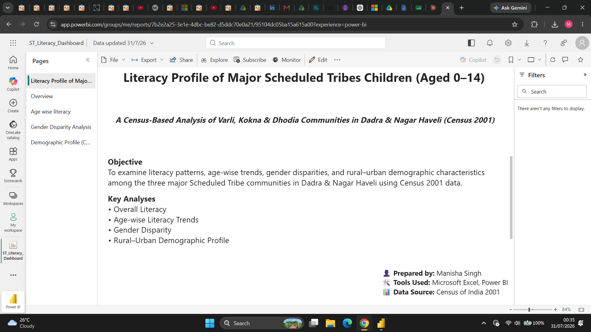
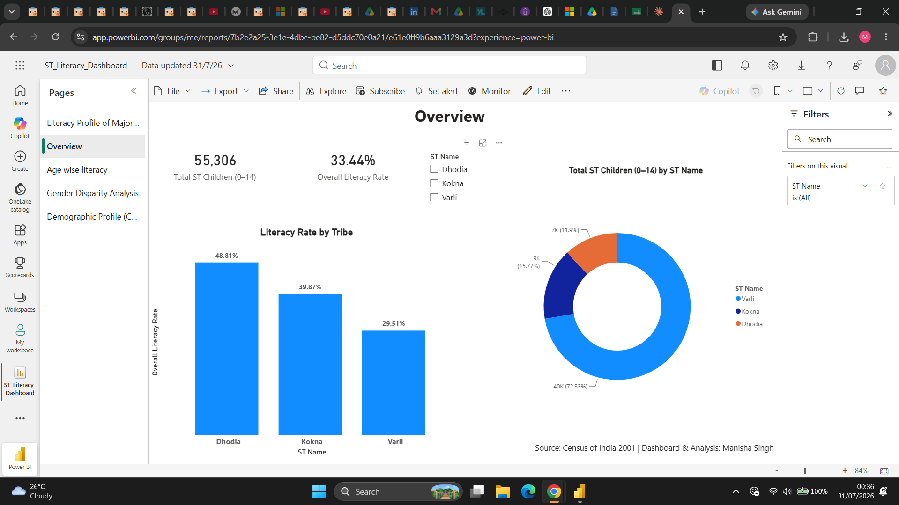
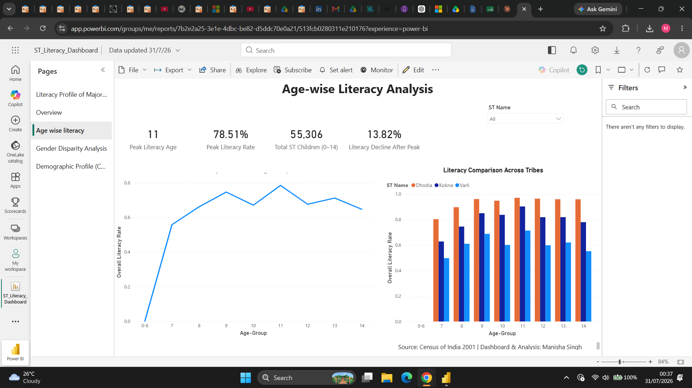
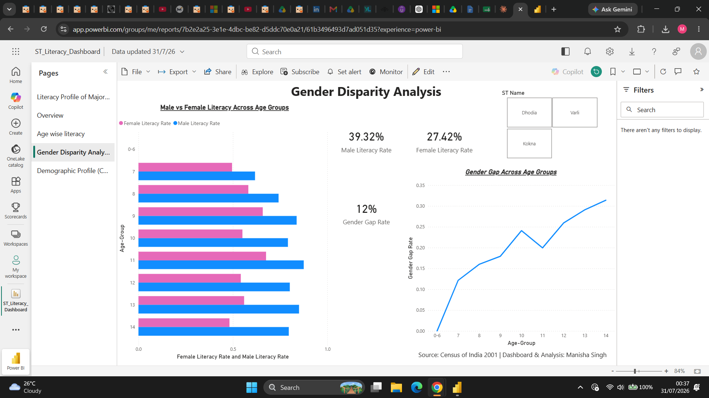
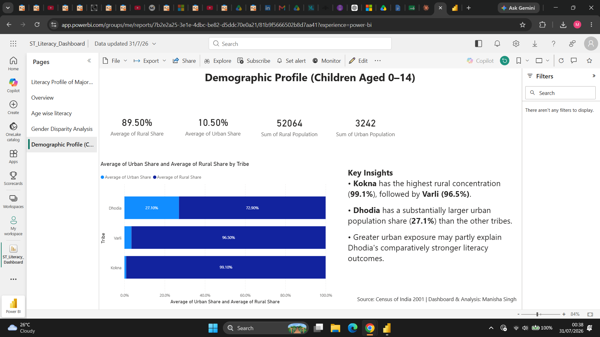

# 📊 ST Educational Literacy Audit Dashboard

### A Census-Based Analysis of Literacy Among Varli, Kokna & Dhodia Children (Aged 0–14) in Dadra & Nagar Haveli

---

## 📖 Project Overview

This project presents an interactive **Power BI dashboard** and a **policy-oriented literacy audit** using **Census of India 2001** data.

The analysis evaluates literacy outcomes among children aged **0–14 years** belonging to the three largest Scheduled Tribe communities of **Dadra & Nagar Haveli**:

- Varli
- Kokna
- Dhodia

The objective is to identify literacy disparities, demographic patterns, gender gaps, and evidence-based policy priorities through interactive data visualisation.

---

# 🎯 Objectives

- Analyse literacy levels among Scheduled Tribe children (0–14 years).
- Compare literacy outcomes across Varli, Kokna and Dhodia communities.
- Examine age-wise literacy trends.
- Assess gender disparities.
- Study rural–urban demographic distribution.
- Develop evidence-based policy recommendations.

---

# 📂 Repository Contents

| File | Description |
|------|-------------|
| **ST_Literacy_Dashboard.pbix** | Interactive Power BI Dashboard |
| **ST_Literacy_Report.pdf** | Detailed Policy Audit Report |
| **Census_Data.xlsx** | Processed Census dataset |
| **README.md** | Project documentation |

---

# 🛠 Tools Used

- Microsoft Excel
- Microsoft Power BI
- DAX
- Pivot Tables
- Data Cleaning
- Data Visualisation

---

# 📊 Dashboard Pages

## 📍 1. Cover Page

Introduces the project objectives, study area and analytical scope.

---

## 📍 2. Overview Dashboard

Displays

- Total ST Children
- Overall Literacy Rate
- Literacy Comparison Across Tribes
- Population Distribution

---

## 📍 3. Age-wise Literacy Analysis

Examines literacy progression across different age groups.

Highlights

- Peak Literacy Age
- Literacy Decline after Age 11
- Tribe-wise Comparison

---

## 📍 4. Gender Disparity Analysis

Compares literacy among boys and girls.

Highlights

- Male vs Female Literacy
- Gender Gap
- Tribe-wise Comparison

---

## 📍 5. Demographic Profile

Explores rural–urban population distribution.

Highlights

- Rural Share
- Urban Share
- Population Distribution
- Key Demographic Insights

---

# 🔍 Key Findings

- Analysed **55,306 Scheduled Tribe children** aged 0–14 years.
- **Varli** accounts for over **72%** of the tribal child population but records the **lowest literacy rate (29.51%)**.
- **Dhodia** records the highest literacy rate (**48.81%**).
- Literacy increases sharply after school-entry age and peaks around **11 years** before declining.
- Female literacy remains consistently lower than male literacy across all three tribes.
- Rural concentration alone does not fully explain literacy outcomes.

---

# 💡 Policy Insights

This project extends beyond descriptive analysis by highlighting policy implications.

- **Intervention Priority:** Varli combines the largest child population, the lowest literacy rate and the widest gender gap, making it the highest priority for targeted interventions.
- **Educational Pipeline:** Literacy declines after age 11, suggesting possible educational leakage during the transition to higher grades.
- **Targeted Resource Allocation:** Concentrating resources on high-need communities is likely to produce greater impact than equal distribution.
- **Early Childhood Opportunity:** The findings reinforce the importance of strengthening Early Childhood Care and Education (ECCE) before formal schooling.
- **Constitutional Delivery Gap:** Persistent disparities despite constitutional guarantees indicate implementation challenges rather than the absence of legal provisions.

---

# 📈 Skills Demonstrated

- Data Cleaning
- Data Analysis
- Microsoft Excel
- Power BI
- DAX
- Dashboard Design
- Data Modelling
- Public Policy Analysis
- Evidence-Based Decision Making
- Data Storytelling

---

# 📚 Data Source

**Census of India 2001**

---

# 👩‍💻 Author

**Manisha Singh**

**Aspiring Data Analyst | Public Policy Research | Power BI | SQL | Python**

GitHub: **https://github.com/manisha-singh-da**

---

## ⭐ If you found this project useful, consider starring the repository.
